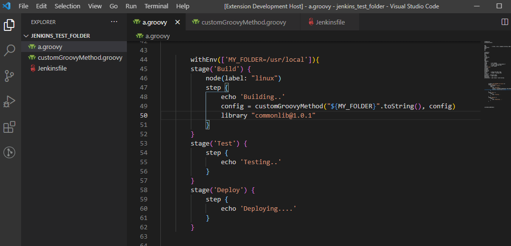
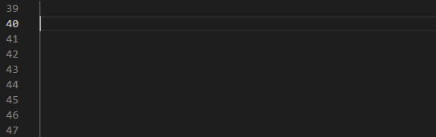
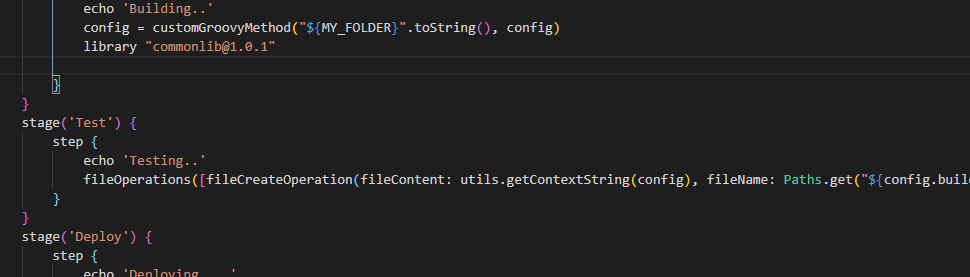

# [Jenkins Doc VSCode extension](https://marketplace.visualstudio.com/items?itemName=Maarti.jenkins-doc)

Provides documentation and autocompletion for Jenkins instructions as well as over 600 Jenkins plugins!

## Features

- Display Jenkins documentation when hovering over recognized instructions:

- Autocompletion for instructions:

- Autocompletion for parameters:

- "Go To Definition" (or `Ctrl` + click) for functions that take you to the Groovy file with the same name:

## Release Notes

What's new?

### [1.8.0](https://github.com/Maarti/JenkinsDocExtension/releases/tag/1.8.0) - 2025-12-26

- "Go To Definition" now prioritizes specific Groovy filenames

### [1.7.0](https://github.com/Maarti/JenkinsDocExtension/releases/tag/1.7.0) - 2021-06-12

- "Go To Definition" for objects methods

### [1.6.0](https://github.com/Maarti/JenkinsDocExtension/releases/tag/1.6.0) - 2021-06-09

- "Go To Definition" now works for functions declared on multiple lines
- Documentation updated

### [1.5.1](https://github.com/Maarti/JenkinsDocExtension/releases/tag/1.5.1) - 2021-04-06

- Bugfix: "Go To Definition" for Groovy files with the same name as the hovered word, followed by a parenthesis or any non-word character

### [1.5.0](https://github.com/Maarti/JenkinsDocExtension/releases/tag/1.5.0) - 2021-03-28

- "Go To Definition" for functions in a different file
- Documentation updated

### [1.4.0](https://github.com/Maarti/JenkinsDocExtension/releases/tag/1.4.0) - 2021-03-22

- "Go To Definition" for functions declared in the same file

### [1.3.0](https://github.com/Maarti/JenkinsDocExtension/releases/tag/1.3.0) - 2021-03-21

- Documentation of Sections (`agent`, `post`, `stages`, `steps`)
- Autocompletion of Sections (`agent`, `post`, `stages`, `steps`)
- Documentation of Directives (`environment`, `options`, `parameters`, `triggers`, `stage`, `tools`, `input`, `when`)
- Autocompletion of Directives (`environment`, `options`, `parameters`, `triggers`, `stage`, `tools`, `input`, `when`)
- Link to documentation website added in the hovering panel
- Support for autocompletion of functions parameters without parenthesis
- Support for autocompletion of functions parameters nested in other function/directive on the same line
- Global order of autocompletions improved
- Required function parameters are now proposed before the optional ones in the autocompletion list

[[...]](./CHANGELOG.md)

See the [Changelog](./CHANGELOG.md)

## Features considered for the future (brainstorming):

- ✅ Documentation for Jenkins instructions
- ✅ "Go To Definition" for file with the same name
- ✅ Autocompletion for Jenkins instructions
- ✅ Autocompletion for instructions parameters
- ✅ Documentation for Jenkins env vars
- ✅ Autocompletion for Jenkins env vars
- ✅ Support Jenkinsfile in the same way as Groovy files
- ✅ Documentation for [Sections](https://www.jenkins.io/doc/book/pipeline/syntax/#declarative-sections)
- ✅ Documentation for [Directives](https://www.jenkins.io/doc/book/pipeline/syntax/#declarative-directives)
- ✅ "Go To Definition" for functions in the same file
- ✅ "Go To Definition" for functions in a different file
- ✅ "Go To Definition" for functions declared on multiple lines
- ⬛ Support [Jenkins parameters](https://www.jenkins.io/doc/book/pipeline/syntax/#parameters) (`booleanParam`, `string`, `extendedChoice`,...)
- ⬛ Support symbols (breadcrumbs and outline in VSCode)
- ❌ Call the [pipeline linter](https://www.jenkins.io/doc/book/pipeline/development/)

See the [Roadmap](https://github.com/Maarti/JenkinsDocExtension/projects/1)
