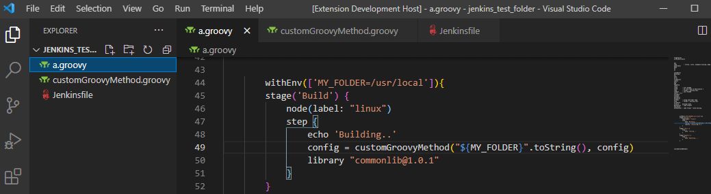

# Jenkins Doc VSCode extension

Provides documentation for Jenkins instructions as well as over 600 Jenkins plugins!
Providing Jenkins documentation when hovering instructions, and "Go To Definition" for groovy files names.

## Features

- Display Jenkins documentation when hovering over recognized instructions:

 
- "Go To Definition" (or `Ctrl`+Click) for functions that take you to the Groovy file with the same name:

## Release Notes

See the [Changelog](./CHANGELOG.md)

## Features considered for the future (brainstorming):
* "Go To Definition" for functions in a file (not just the file itself)
* Autocompletion for Jenkins instructions
* Autocompletion for Jenkins env vars
* Documentation for Jenkins env vars
* Support Jenkinsfile in the same way as Groovy files
* Support Jenkins parameters (`booleanParam`, `string`, `extendedChoice`,...)
* Support symbols (breadcrumbs and outline in VSCode)
* Check if we can call the [pipeline linter](https://www.jenkins.io/doc/book/pipeline/development/)